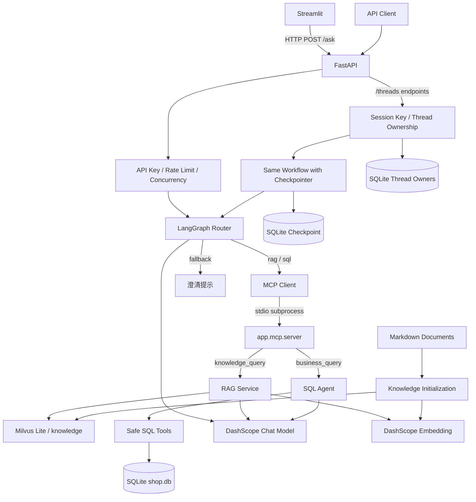

# AI Data Assistant

[](https://github.com/wutian88/ai-data-assistant/actions/workflows/ci.yml)

## 1. Project Overview

AI data assistant backend prototype with FastAPI, LangGraph, MCP, RAG and safe SQL querying, including auth, observability, regression tests and Docker deployment.

这是一个用于求职展示的 **portfolio project**：用户用自然语言查询合成电商数据，或检索公司政策知识库。重点展示从 HTTP 接口、工具权限控制到测试和部署的完整后端链路。

- **业务数据问答**：SQLite 中有 1,000 位用户、200 种商品、10,000 笔订单，支持城市分布、订单时间窗口和商品统计。
- **政策知识问答**：从版本化 Markdown 文档生成知识库，回答退款、配送、会员、支付和商品规则，并返回来源。
- **轻量展示**：Streamlit 通过 HTTP 调用 FastAPI，展示路由、来源、Request ID、Token 和耗时。
- **可验证的工程行为**：离线 pytest、8 模块 regression、GitHub Actions 工作流以及 Docker SQL/RAG 实际链路验证。

当前数据和政策都是合成演示资料；项目定位是后端原型，不用于真实退款审批或支付操作。聊天模型为 `qwen3.7-flash-2026-07-15`，Embedding 为 `text-embedding-v4`，使用 DashScope 服务。

## 2. Features

| 能力 | 实现 |
| --- | --- |
| API | FastAPI 请求校验、Swagger、liveness/readiness |
| 路由 | LangGraph 将问题分为 `sql`、`rag`、`fallback` |
| 工具协议 | 唯一正式 MCP stdio Server，提供 `business_query` 和 `knowledge_query` |
| RAG ingestion | Markdown → 分块 → Embedding → Milvus Lite，带来源元数据和成功 marker |
| SQL | SELECT-only、表/列白名单、AST 校验、只读连接、行数和超时限制、审计 |
| 用户隔离 | API Key、Session Key、thread ownership、SQLite checkpoint |
| 可观测性 | Request ID、路由、错误码、Token usage、请求/节点耗时 |
| 展示与验证 | 独立 Streamlit UI、离线 CI、工程回归、手动模型评测、Docker |

## 3. Architecture



Streamlit 不 import 后端 workflow 或 service。FastAPI 使用 `app.main:app`；MCP Client 使用同一解释器启动 `python -m app.mcp.server`。MCP 是 stdio 子进程，不单独暴露 HTTP 端口。Session 使用相同 workflow 定义，额外编译带 SQLite checkpointer 的实例。

## 4. Request Flow

1. 客户端提交 `{"question": "..."}`；HTTP middleware 先生成 `request_id` 并记录请求上下文。
2. FastAPI 接口校验问题、鉴权、限流并获取并发槽位；将该 `request_id` 传入 Graph state，响应头也返回 `X-Request-ID`。
3. Router 分类；SQL/RAG 节点通过 MCP 调用对应工具，`fallback` 返回澄清提示。
4. 后端返回答案、来源、错误码、可观测 Token 和耗时。
5. Session 接口在读取或执行 Graph **之前**检查 thread 归属，并持久化状态。

| 接口 | 凭证 | 行为 |
| --- | --- | --- |
| `GET /health/live` | 无 | 检查 Web 进程存活 |
| `GET /health/ready` | 无 | 检查 SQLite 可读、模型凭证配置存在 |
| `POST /ask` | `X-API-Key` | 单次问答，不保存 Session checkpoint |
| `POST /threads` | 两种 Key | 创建用户所属 thread，返回 201 |
| `GET /threads/{thread_id}` | 两种 Key | 读取该用户最新 thread 状态 |
| `POST /threads/{thread_id}/ask` | 两种 Key | 执行隔离问答并写入 checkpoint |
| `GET /rate-limit-test` | `X-API-Key` | 限流验证接口 |

问题去掉首尾空白后不能为空，最长 1,000 字符。鉴权失败返回 401；未知 thread 或其他用户的 thread 返回 404；限流/并发槽位不足返回 429。业务失败也可能以 HTTP 200 返回 `error` 和 `error_code`，客户端应同时检查。

## 5. RAG Pipeline

知识输入位于 `data/knowledge/`，随源码版本管理：

| 文件 | 展示来源 |
| --- | --- |
| `refund_policy.md` | 售后规则 |
| `shipping_policy.md` | 物流规则 |
| `membership.md` | 会员规则 |
| `payment.md` | 支付规则 |
| `product_policy.md` | 商品规则 |

`python -m scripts.init_knowledge` 读取所有非空 Markdown，按中文标点和段落进行 recursive character splitting：`chunk_size=500`、`chunk_overlap=80`，以字符数计量。每个 chunk 保存 `source`、`source_path`、`chunk_index`；来源名优先使用一级标题。当前 5 份短文档生成 5 个 chunk；文档增长后可生成更多分块。

- 保留 `text-embedding-v4`、Milvus Lite `knowledge` collection、`FLAT` 索引、`COSINE` 距离和 Top-3 检索。
- Fingerprint 包含文档内容/相对路径、分块参数、Embedding 模型及 collection/index 配置。
- 只有 marker 的版本、fingerprint、chunk 数量与实际 collection 行数均一致时，才跳过初始化。
- 先校验全部输入，再重建 `knowledge` collection；写入完成并核对行数后原子发布 marker。失败不会留下成功 marker。
- 输入文档来自源码目录；运行库和 marker 位于 `APP_DATA_DIR`。Docker 中分别是 `/app/data/knowledge/` 与 `/data/`。

检索材料与系统指令分开传给模型，答案返回有意义的来源。退款资料规定：**签收后 7 天内申请退款，审核通过后 3 个工作日内原路退回**；资料没有承诺审核耗时。

## 6. Safe SQL Agent

Agent 只能使用授权的表列表、schema 和 `safe_sql_query` 工具；权限由代码验证，不能靠 Prompt 放宽。

| 表 | 授权字段 | 演示数量 |
| --- | --- | --- |
| `users` | `id, name, city, created_at` | 1,000 |
| `products` | `id, name, price, category` | 200 |
| `orders` | `id, user_id, product_id, quantity, status, created_at` | 10,000 |

执行前进行单条 SELECT、查询作用域、表和列白名单检查；拒绝写操作、多语句、`SELECT *`、CTE、子查询、UNION 等未支持的语法。允许受控的单层 SELECT、显式 JOIN、聚合和日期分组；最多返回 100 行，SQLite 只读连接配合 progress handler 将执行时间限制为 2 秒。表列表/schema 也只返回授权元数据，`demo_metadata` 不对 Agent 开放。

数据通过 `python -m scripts.init_demo_db` 自动生成，固定 `seed=42` 和观察日 **2026-10-01**，使用合成用户名称。数据库内保存版本、种子、时间口径和 fingerprint，便于复现及评测核对。

统计口径：

- “最近 30 天”包含观察日：`2026-09-02 <= created_at < 2026-10-02`，不随系统日期变化。
- 订单笔数默认包含全部状态；只有问题明确要求时才筛选状态。
- 销量和金额默认排除 `cancelled`；用户明确指定的状态口径优先。
- 金额是 `quantity × 当前 products.price` 的估算，**不是历史成交金额**。

正常初始化不覆盖已有数据库。已有精确匹配的旧 4 用户/3 商品/5 订单演示库，可显式使用 `--upgrade-demo`：脚本验证完整旧数据，保留经校验的 SQLite 备份并在事务内升级；修改过的旧库和未知数据库会被拒绝，不会自动替换。

SQL 审计保留 success/blocked/timeout/failed 与 SQL 文本，目前写入工作目录的 `sql_audit.log`，不属于 `/data` Volume；Git 忽略该日志。离线测试将审计输出重定向到临时目录。

## 7. Security

| 控制 | 范围与边界 |
| --- | --- |
| 应用鉴权 | 受保护接口要求 `X-API-Key`，服务端使用 `secrets.compare_digest` 做常量时间比较 |
| Session 身份 | `X-Session-Key` 映射两个固定演示用户，不接受客户端传入的用户身份 |
| Thread 隔离 | 服务端生成 `thread_id`；访问前核对所有者，避免跨用户读取/执行 |
| 并发 | 进程内 semaphore；同一 thread 还有写锁 |
| Rate Limit | 按应用 API Key 的哈希分桶，不直接以真实 Key 作为字典键 |
| SQL 权限 | 工具级 AST/allowlist/只读/行数/超时检查 |
| RAG 防护 | 将检索资料作为数据处理，测试覆盖已知注入场景 |
| 配置保护 | 根目录 `.env` 及运行数据库不提交，也不复制进镜像 |

Streamlit 从环境变量或根 `.env` 读取 Key，也可使用密码输入框；不把凭证写入请求 URL。保存和展示响应前会脱敏，不展示可能含凭证的网络异常字符串，不自动重试产生模型费用的请求。

## 8. Observability

`/ask` 保留以下字段，Session 响应另包含 `thread_id` 和汇总 usage：

| 字段 | 含义 |
| --- | --- |
| `request_id` | HTTP、Graph 与日志关联；响应头也提供 `X-Request-ID` |
| `route` | `sql` / `rag` / `fallback` |
| `answer`, `sources` | 答案及检索来源 |
| `error`, `error_code` | 业务失败信息和稳定错误码 |
| `total_cost` | **后端耗时，单位秒；不是金额** |
| `router_tokens` | Router 返回的 input/output/total/reasoning usage |
| `service_tokens` | RAG 或 SQL 服务可观测的 LLM usage |
| `observed_request_tokens` | 可完整汇总时的 Router + service usage；fallback 使用 Router usage |

缺失 usage 保持 `null`，UI 显示“未知”，不把未知值记为 0。这些是可观测的聊天模型 Token，**不是完整账单**，不包含无法取得的 Embedding Token。日志记录路由、状态、错误码及请求/节点计时；UI 同时展示客户端 HTTP 耗时与后端耗时。

## 9. Testing

安装开发依赖后，在项目根目录执行，无需真实 `.env` 或模型 Key：

```sh
python -m pytest tests
python -m scripts.run_regression
```

pytest 和 regression 使用测试专用隔离：无效测试凭证、项目外临时 SQLite 数据、Mock LLM/HTTP/检索器、socket/DNS guard；阻止读取私有根 `.env`，RAG 回归不启动 Milvus。测试保护不进入正常业务启动链路。原 8 个 regression 模块继续通过 subprocess 执行，pytest 包含这 8 个包装用例。

**2026-10-02 验收记录：**

| 检查 | 实际结果 |
| --- | --- |
| Windows Python 3.13 pytest | 96 passed，27.50 秒 |
| Linux Python 3.13 pytest | 96 passed，28.10 秒；容器断网、仓库只读 |
| 8 模块 regression | Windows / Linux 均 8/8 PASS |
| Streamlit UI 离线 AppTest | 18 个用例通过，覆盖输入、显示、鉴权、限流、超时、异常响应及状态清理 |
| SQL 实际 HTTP | 用户数 1,000；北京用户 116；最近 30 天订单 3,371，`route=sql` |
| RAG 实际 HTTP | `route=rag`，退款回答正常，来源包含“售后规则” |
| Retriever | 实际返回 3 条文档，包含售后规则/商品规则/支付规则 |
| Streamlit → FastAPI | 实际 AppTest 提交 SQL/RAG 问题成功；本机 UI 服务健康 |
| Docker | Compose config/build/up、healthy、liveness/readiness 通过 |

96 是 pytest 用例数量，不是所有原脚本内部断言的总数，也不是模型正确率。

GitHub Actions 在 push、pull request 或手动触发时使用 Python 3.13，分别执行依赖安装、pytest、8 模块 regression；checkout/setup-python 固定版本 SHA，权限为 `contents: read`。**本轮未 commit/push，远程 Actions 尚未执行**；上方 badge 在工作流发布后显示真实远程状态。本地 Windows 和断网 Linux 验证已通过。

`tests/manual/` 和 `evals/` 不由默认 pytest 收集。模型效果评测需要真实服务，可能产生费用，单独手动运行：

```sh
python -m evals.router
python -m evals.rag_retrieval
python -m evals.rag_answers
python -m evals.sql_answers
```

输入位于 `evals/datasets/`，新报告写入 Git 忽略的 `evals/reports/`。SQL 数据集有 16 个 gold SQL 案例，已验证标注 SQL 的安全执行和实际结果；**这不等于 SQL Agent 的 16 题回答评分**。模型答案保留人工判断字段，不将关键词命中当作完整质量结论。`evals/examples/` 是旧 4 用户/5 订单数据的历史输出，不代表本次评测结果。

## 10. Docker

完整后端优先使用 Docker Desktop 的 Linux 容器。先按下一节填写根 `.env`，再在项目根目录执行：

```sh
docker compose config --quiet
docker compose build
docker compose up -d
docker compose ps
```

服务地址：`http://localhost:8000`；Swagger：`http://localhost:8000/docs`。Compose 按顺序初始化 SQL、初始化知识库，然后启动 `app.main:app`。Docker 健康检查只调用 liveness，不调用模型。

```sh
curl http://localhost:8000/health/live
curl http://localhost:8000/health/ready
docker compose logs --tail 100 app
```

PowerShell 也可用 `Invoke-RestMethod http://localhost:8000/health/live`。预期状态分别为 `alive` 和 `ready`。

`APP_DATA_DIR=/data`，默认 Compose 项目 `ai-data-assistant` 使用 `ai-data-assistant_app-data` 卷。若迁移已有部署并更换目录，使用 `docker compose -p <原项目名> ...` 保持原项目名，从而继续连接原 Volume。普通 `docker compose down` 保留卷，带 `-v` 会删除持久化数据。

镜像只包含后端、初始化脚本和 Markdown 输入，不包含 UI、测试、评测、真实 `.env` 或运行数据库。UI 在宿主机单独运行，通过 HTTP 调用容器后端。

需要升级精确匹配的旧演示库时，先停止业务写入，显式执行一次升级，再恢复服务：

```sh
docker compose stop app
docker compose run --rm --no-deps app python -m scripts.init_demo_db --upgrade-demo
docker compose up -d
```

这是可选的旧演示数据迁移，新部署无需此步骤；普通启动不会自动升级已有库，未知数据不能用此命令替换。

## 11. Local Quick Start

使用 Python 3.13。三个依赖文件的关系：`requirements.txt` 是后端运行依赖，`requirements-ui.txt` 是独立展示层依赖，`requirements-dev.txt` 包含前两者和 pytest/本机测试依赖。只运行 UI 时无需安装后端技术栈。

PowerShell：

```powershell
python -m venv .venv
.\.venv\Scripts\Activate.ps1
python -m pip install -r requirements-dev.txt
if (-not (Test-Path .env)) { Copy-Item .env.example .env }
notepad .env
```

Linux：

```sh
python3.13 -m venv .venv
source .venv/bin/activate
python -m pip install -r requirements-dev.txt
[ -f .env ] || cp .env.example .env
```

填写 `.env` 后初始化并启动后端：

```sh
python -m scripts.init_demo_db
python -m scripts.init_knowledge
python -m uvicorn app.main:app --host 127.0.0.1 --port 8000 --reload
```

在另一个已激活同一虚拟环境的终端启动 UI；使用 Docker 后端时也可以采用此方式：

```sh
python -m streamlit run ui/app.py --server.address 127.0.0.1 --browser.gatherUsageStats false
```

打开 `http://127.0.0.1:8501`，侧栏确认 API Base URL 和 API Key，输入问题后发送。UI 当前使用 `/ask` 单次问答，不要求 Session Key；Thread API 仍可通过 `/docs` 单独演示。

> Streamlit 截图待补：补充一次 SQL 和一次 RAG 查询的真实页面截图，保留 Route、Sources、Request ID、Token 与耗时，遮盖凭证后再添加到 README。

配置仅从项目根 `.env` 读取，已有进程环境变量优先：

| 配置 | 用途 |
| --- | --- |
| `DASHSCOPE_API_KEY` | 聊天模型和 Embedding 服务；完整请求/知识初始化需要真实有效凭证 |
| `APP_API_KEY` | 后端 `X-API-Key`，也供本机 UI 使用 |
| `DAY19_USER_A_KEY`, `DAY19_USER_B_KEY` | 两个非空且不同的 Session 演示凭证；保留兼容配置名 |
| `API_BASE_URL` | UI 的后端地址，默认 `http://127.0.0.1:8000` |
| `MAX_CONCURRENT_REQUESTS` | 单进程 AI 并发上限；示例 2，代码默认 4 |
| `CONCURRENCY_WAIT_SECONDS` | 并发槽位等待时间，默认 0.2 秒 |
| `RATE_LIMIT_REQUESTS` | 每窗口应用 Key 请求上限；示例 5，代码默认 20 |
| `RATE_LIMIT_WINDOW_SECONDS` | 限流窗口，默认 60 秒 |
| `APP_DATA_DIR` | 本机默认根目录 `data/`；Compose 固定 `/data` |

本机安装保留 Windows `milvus-lite==3.2.1` 测试依赖；完整服务仍建议使用已验证的 Linux Docker 环境。离线工程测试无需知识初始化或真实凭证；知识初始化与实际 AI 问答需要外部 DashScope 服务。

## 12. Example Questions

| 问题 | 路由 / 预期 |
| --- | --- |
| 数据库一共有多少位用户？ | SQL，1,000 |
| 北京用户有多少？ | SQL，116 |
| 最近 30 天订单量是多少？ | SQL，3,371；固定观察日 2026-10-01，包含所有订单状态 |
| 各城市用户数量分别是多少？ | SQL，按城市分组 |
| 排除取消订单，各类商品销量分别是多少？ | SQL，按类别统计购买件数 |
| 排除取消订单，按当前商品价格估算，订单金额最高的商品是什么？ | SQL，当前价格估算，非历史成交额 |
| 公司的退款规则是什么？ | RAG，来源包含“售后规则” |
| 公司支持哪些支付方式？ | RAG，支付规则 |

可直接在 Streamlit 或 `/docs` 中发送。Swagger 的 Authorize 使用 `X-API-Key`；Session 演示额外设置 `X-Session-Key`，创建 thread 后使用服务端返回的 ID。

## 13. Project Structure

```text
app/
├── main.py                         # FastAPI
├── api/sessions.py                 # Session 路由 / lifecycle
├── core/
│   ├── config.py                    # 鉴权、并发、限流配置
│   ├── paths.py                     # 根 .env / 源文档与运行数据路径
│   ├── llm.py                       # Chat / Embedding
│   ├── observability.py             # Token usage
│   └── thread_access.py             # SQLite ownership
├── workflow/{graph.py,router.py}    # LangGraph
├── services/
│   ├── knowledge.py                 # 文档、分块、fingerprint
│   ├── rag.py
│   ├── sql_agent.py
│   └── vector_store.py
└── mcp/{client.py,server.py}        # 唯一正式 MCP Server
ui/app.py                           # 独立 HTTP 展示
scripts/
├── init_demo_db.py                  # seed / 旧演示库显式升级
├── init_knowledge.py                # ingestion / marker
└── run_regression.py
tests/                              # pytest / regression / offline guards
├── regression/
├── manual/                         # 手动真实服务探测
├── bootstrap/sitecustomize.py
└── test_*.py
evals/                              # 小规模效果评测
├── datasets/
├── examples/                       # 历史输出
└── reports/                        # 生成报告，Git 忽略
data/
├── knowledge/*.md                  # 提交到 Git 的输入文档
└── 运行数据库与 marker              # Git 忽略
.github/workflows/ci.yml
Dockerfile
compose.yaml
requirements{,-ui,-dev}.txt
.env.example
README.md
```

`app/core/paths.py` 统一定义运行数据路径。以下旧 basename 为兼容已有 Volume 而保留，不依赖旧学习目录：

| 运行文件/目录 | 用途 |
| --- | --- |
| `shop.db` | 合成业务数据和数据集元信息 |
| `milvus_day14.db` | Milvus Lite；当前运行时表现为目录 |
| `.milvus_day14_initialized` | 已验证成功的知识 fingerprint marker |
| `day19_thread_owners.db` | Thread ownership |
| `day19_session_checkpoints.db` | LangGraph checkpoint |

真实 `.env`、SQLite/WAL/SHM、Milvus 数据、日志、升级备份和生成评测报告均忽略；`data/knowledge/**/*.md` 是需要提交的源资料。

## 14. Known Limitations

- SQLite、Milvus Lite 和当前数据规模适合单机原型；没有独立数据库服务、分布式索引或多副本协调。
- Session Key 只演示两个固定身份，未接注册、登录、JWT 或凭证轮换；checkpoint 保存最新状态，不自动组成多轮聊天历史。
- 限流和并发位于单进程内存，重启会重置，不能跨多 worker/副本共享；限流按应用 Key 而非独立 Session 用户分桶。
- `/health/ready` 只检查 SQLite 和配置存在，不实际验证 Embedding、LLM 可用性或 Milvus 检索；完整链路仍需要真实请求验收。
- SQL AST 规则采用默认拒绝，受限语法不等于完整 SQLite 沙箱；审计仍需单独考虑脱敏、权限、持久化和保留期限。
- 知识库只有 5 份合成文档，小规模评测不能代表真实业务泛化能力；指令分离不保证阻挡所有 Prompt Injection。
- 知识重建不是零停机索引切换；修改文档后应在停止业务写入的维护窗口初始化，失败时不会保留成功 marker。
- 固定日期使数据可复现，不能把“最近 30 天”解释成运行当天；当前价格估算不能冒充历史交易收入。
- Token usage 是可观测子集，缺失部分保持未知，不用于直接核对账单。
- 后端保留稳定基线的 API metadata 和兼容配置名；核心直接依赖已固定，但未完整锁定所有传递依赖。
- 本轮 CI 工作流已通过本地隔离验证，远程 CI 在提交并推送后才会产生结果。
