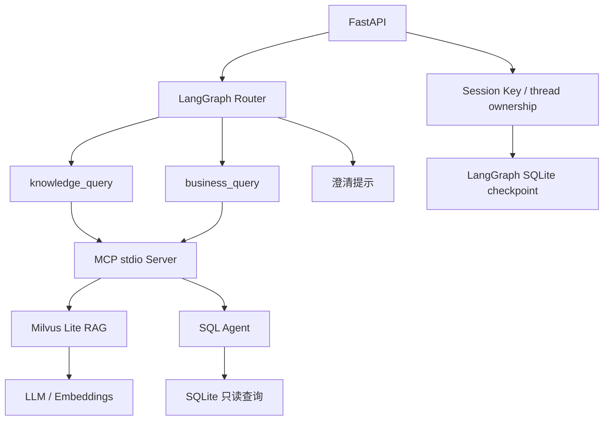

# AI Data Assistant

一个可运行的 AI 数据问答项目：FastAPI 接收问题，LangGraph 将请求路由到知识库 RAG、SQLite SQL Agent 或澄清提示；业务工具通过 MCP stdio subprocess 调用。

项目将 API、工作流、业务服务、MCP、测试和评测分开组织。工程结构基于 `before-refactor` 已验证版本整理，保留原模型、Prompt、Tool 名称、鉴权规则和响应结构。

## 运行链路



- FastAPI：`/ask`、Session 接口、请求校验、`request_id`、日志、并发限制和 Rate Limit。
- LangGraph：`rag`、`sql`、`fallback` 路由，节点计时和可观测的 Token usage 汇总。
- RAG：Milvus Lite `knowledge` collection、Top-3 检索、来源返回、检索内容与系统指令分离。
- SQL Agent：受控表/字段白名单、SQL AST 校验、只读连接、最多 100 行、查询执行超时与审计日志。
- MCP：唯一正式 Server，提供 `knowledge_query`、`business_query`，返回 structured output 和 usage。
- Session：固定双用户身份凭证、服务端生成 `thread_id`、归属校验、同一 thread 写锁、SQLite checkpoint。
- Docker：启动前自动初始化 SQL / RAG 演示数据，通过持久化 Volume 保存数据库。

当前模型保持为 `qwen3.7-flash-2026-07-15`，Embedding 为 `text-embedding-v4`；聊天模型使用 DashScope OpenAI-compatible 接口，`temperature=0`。

## 项目结构

```text
app/
├── main.py                       # FastAPI 入口
├── api/sessions.py               # Session HTTP 接口和生命周期
├── core/
│   ├── config.py                  # 应用配置
│   ├── paths.py                   # 根目录 .env 与数据路径
│   ├── llm.py                     # Chat / Embedding 配置
│   ├── observability.py           # Token usage 辅助函数
│   └── thread_access.py           # thread ownership 存储
├── workflow/
│   ├── router.py                  # 问题分类
│   └── graph.py                   # State、节点、边和 Graph builder
├── services/
│   ├── rag.py
│   ├── sql_agent.py
│   └── vector_store.py
└── mcp/
    ├── client.py                  # stdio 启动、超时和返回校验
    └── server.py                  # 正式 Tool Server
scripts/
├── init_demo_db.py
├── init_knowledge.py
└── run_regression.py
tests/
├── test_regression.py             # pytest 包装原 8 个回归模块
├── regression/                   # 保留原脚本 / unittest 逻辑
└── manual/                       # 需要真实服务或模型的探测
evals/
├── router.py
├── rag_retrieval.py
├── rag_answers.py
├── sql_answers.py
├── datasets/                     # 输入案例
├── examples/                     # 历史评测结果示例
└── reports/                      # 新生成的报告，Git 忽略
data/                            # 本机运行数据，Git 忽略
Dockerfile
compose.yaml
requirements.txt
requirements-dev.txt
.env.example
```

所有包目录均包含 `__init__.py`。本地学习归档不属于正式服务，也不进入 Docker 镜像。

## 配置

仅使用项目根目录 `.env`；已注入的进程环境变量优先于 `.env`。真实密钥和数据库不提交 Git。

在 PowerShell 中首次配置：

```powershell
if (-not (Test-Path .env)) { Copy-Item .env.example .env }
notepad .env
```

| 配置 | 用途 |
| --- | --- |
| `DASHSCOPE_API_KEY` | 聊天模型和 Embedding 服务 |
| `APP_API_KEY` | `X-API-Key` 应用访问凭证 |
| `DAY19_USER_A_KEY`、`DAY19_USER_B_KEY` | 两个不同的 `X-Session-Key` 用户凭证；沿用已有配置名 |
| `MAX_CONCURRENT_REQUESTS` | 进程内 AI 请求并发上限；示例配置 2，代码默认 4 |
| `CONCURRENCY_WAIT_SECONDS` | 等待并发槽位时间，默认 0.2 秒 |
| `RATE_LIMIT_REQUESTS` | 每窗口请求上限；示例配置 5，代码默认 20 |
| `RATE_LIMIT_WINDOW_SECONDS` | 限流窗口，默认 60 秒 |
| `APP_DATA_DIR` | 可选数据目录；本机默认项目根目录 `data/`，Compose 设置为 `/data` |

两个 Session Key 必须非空且不同。它们用于演示用户隔离，不是通用账号系统。

## Docker 运行

Windows 完整服务优先使用 Docker Desktop 的 Linux 容器。配置好根目录 `.env` 后，在项目根目录执行：

```powershell
docker compose config --quiet
docker compose build
docker compose up -d
docker compose ps
```

服务地址为 `http://localhost:8000`，交互文档为 `http://localhost:8000/docs`。Compose 依次执行：

```sh
python -m scripts.init_demo_db &&
python -m scripts.init_knowledge &&
exec python -m uvicorn app.main:app --host 0.0.0.0 --port 8000
```

FastAPI 入口为 `app.main:app`；MCP Client 使用同一 Python interpreter 执行 `python -m app.mcp.server`。MCP 是 stdio 服务，不单独暴露 HTTP 端口。

```powershell
Invoke-RestMethod http://localhost:8000/health/live
Invoke-RestMethod http://localhost:8000/health/ready
docker compose logs --tail 100 app
```

预期 `/health/live` 返回 `status=alive`，`/health/ready` 返回 `status=ready`。Docker 健康检查只调用 liveness，不调用模型。

默认 Compose 项目名取自根目录。当前目录 `My_FastAPI` 使用 `my_fastapi_app-data` 卷；迁移已有部署时保持项目名和卷，避免因换名而连接到新的空卷。`docker compose down` 保留卷，`docker compose down -v` 会删除持久化数据。

## 本机开发与测试

使用 Python 3.13，在项目根目录创建或使用虚拟环境：

```powershell
python -m venv .venv
.\.venv\Scripts\Activate.ps1
python -m pip install -r requirements-dev.txt
python -m scripts.init_demo_db
python -m scripts.init_knowledge
python -m uvicorn app.main:app --host 127.0.0.1 --port 8000
```

知识初始化和完整 AI 请求需要可用的 DashScope 凭证及网络连接。开发依赖固定已验证的 `pytest==9.1.1`，Windows 显式使用已验证的 `milvus-lite==3.2.1`；运行依赖沿用稳定基线。

回归入口保留原 8 个模块的执行方式：

```powershell
python -m scripts.run_regression
python -m pytest tests
python -m tests.regression.sql_complex_security
```

核心 runner 预期 `8/8 PASS`，pytest 参数化包装预期 `8 passed`。覆盖 SQL security、SQL tool、SQL metadata security、SQL scope、RAG security、thread access、Session HTTP、Session checkpoint。额外 SQL 复杂安全检查单独执行，不计入原 8 模块基线。

默认 pytest 不收集 `tests/manual/` 或 `evals/`。部分回归在 import 时初始化模型或向量库配置，因此仍需根目录 `.env`，但核心回归不调用真实聊天模型。

## API 与演示请求

| 接口 | 凭证 | 行为 |
| --- | --- | --- |
| `GET /health/live` | 无 | 进程存活 |
| `GET /health/ready` | 无 | SQL 数据库可读、模型 Key 配置存在 |
| `POST /ask` | `X-API-Key` | 普通 Graph 请求，不持久化会话 checkpoint |
| `POST /threads` | 两种 Key | 创建用户所属 thread，返回 201 |
| `GET /threads/{thread_id}` | 两种 Key | 读取该用户的最新 thread 状态 |
| `POST /threads/{thread_id}/ask` | 两种 Key | 隔离执行并写入 checkpoint |
| `GET /rate-limit-test` | `X-API-Key` | 保留的限流验证接口 |

问题请求体为 `{"question": "..."}`，去除首尾空白后必须非空，最长 1000 字符。错误应用凭证返回 401；其他用户的 thread 与未知 thread 均返回 404；触发限流或并发限制返回 429。

可以在 `/docs` 的 Authorize 中设置 Key。下面的 PowerShell 示例通过 Python 从根目录 `.env` 读取凭证，不在源码中填写真实 Key：

```powershell
@'
import httpx
from dotenv import dotenv_values

config = dotenv_values(".env")
headers = {"X-API-Key": config["APP_API_KEY"]}
with httpx.Client(base_url="http://localhost:8000", timeout=120) as client:
    for question in ["数据库一共有多少位用户？", "公司的退款规则是什么？"]:
        response = client.post("/ask", headers=headers, json={"question": question})
        response.raise_for_status()
        result = response.json()
        print({key: result[key] for key in ("route", "answer", "sources", "error_code")})
'@ | python -
```

初始化后的演示数据与验收预期：

- SQL：4 位用户、5 笔订单、`SUM(quantity)=9`。询问用户数量应得到 `route=sql`、答案为 4、`error_code=null`。
- RAG：5 条演示知识。退款问题应得到 `route=rag`，`sources` 包含“售后规则”。当前知识包括签收后 7 天内申请退款，以及审核通过后 3 个工作日内原路退回。

Session 请求在同一 headers 中额外加入 `X-Session-Key`。创建 thread 后使用服务端返回的 `thread_id`，客户端不能指定用户身份或访问另一用户的 thread。

`/ask` 保留 `request_id`、`route`、`answer`、`sources`、`error`、`error_code`、`total_cost`、Router/service/observed-request Token 字段。usage 缺失时保持 `null`，不将未知用量写成 0。Session 响应沿用自己的结构，包含 `thread_id` 和汇总 usage。

## 数据持久化与初始化

`app/core/paths.py` 是唯一公共路径定义。本机默认 `data/`，Docker 固定 `/data`：

| 文件或目录 | 用途 |
| --- | --- |
| `shop.db` | SQLite 演示业务数据 |
| `milvus_day14.db` | Milvus Lite 向量库；当前运行时表现为目录 |
| `.milvus_day14_initialized` | 知识初始化成功 marker |
| `day19_thread_owners.db` | thread ownership |
| `day19_session_checkpoints.db` | LangGraph checkpoint |

保留这些旧数据名称是为了兼容已有 Volume，不表示正式源码仍依赖旧阶段目录。SQLite 的 WAL/SHM 属于运行数据；移动已使用的数据时应先停止写入或使用一致性备份。

SQL 初始化脚本遇到已有数据库跳过。知识初始化只有“Milvus 数据存在且成功 marker 存在”才跳过，初始化失败不写成功 marker；缺少 marker 时会重建演示 collection。collection 保持 `knowledge`、`FLAT` 索引、`COSINE` 距离。

镜像只包含正式运行代码和初始化脚本；真实 `.env`、本地数据库、学习归档、测试、评测及其他独立项目均不进入镜像。

## AI 效果评测

评测与工程回归分开执行，以下命令会使用真实模型或检索器，可能产生 API 用量：

```powershell
python -m evals.router
python -m evals.rag_retrieval
python -m evals.rag_answers
python -m evals.sql_answers
```

输入位于 `evals/datasets/`，新报告写入 `evals/reports/` 并由 Git 忽略。`evals/examples/` 是历史结果示例，不代表当前代码的新测试结果。答案评测保留人工判断字段，不把关键词匹配当作完整质量结论。

## 当前边界

- Session 使用两个配置 Key 映射固定身份，尚未接入注册、登录、JWT 或凭证轮换。
- checkpoint 保存当前最新问题和答案，未拼接多轮聊天历史。
- Rate Limit 按应用 API Key 分桶，计数和并发槽位位于单个进程内存，重启会重置，不跨多 worker 或多副本共享。
- `/health/ready` 不实际调用模型或验证 Milvus 检索，完整链路要通过真实 SQL / RAG 请求和 Retriever 检查验收。
- SQL 校验采用默认拒绝策略，只支持受限单层 SELECT；拒绝 CTE、嵌套 SELECT、子查询、JOIN USING 和 NATURAL JOIN。它不是通用 SQL 沙箱，不能据此宣称生产级安全。
- RAG 的指令分离与测试降低了已覆盖的注入风险，不保证所有恶意检索内容都无法影响模型。
- requirements 沿用稳定基线，未锁定所有传递依赖；后续依赖升级应单独验证。
- 本轮保留原 OpenAPI metadata 和兼容配置名称，避免结构整理改变已有 API 契约。
